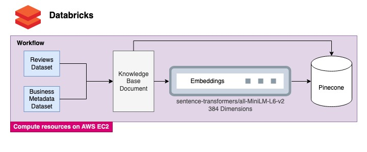
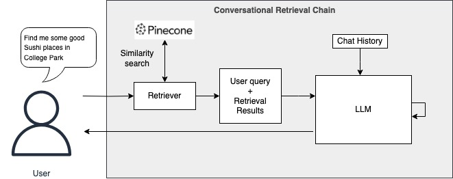
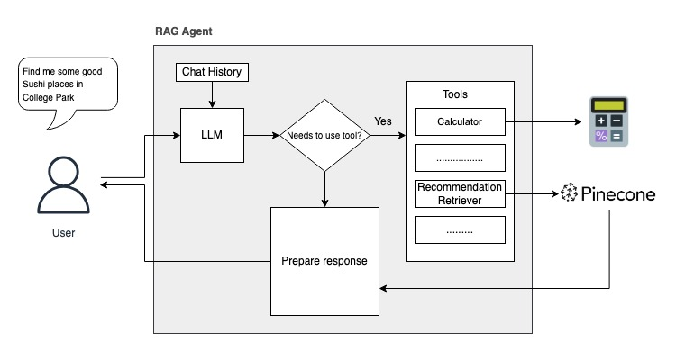

- [Introduction](#introduction)
- [Methodology](#methodology)
  - [Data Collection and Preparation](#data-collection-and-preparation)
  - [System Architecture](#system-architecture)
  - [Chatbot Development](#chatbot-development)
    - [Conversational Retrieval Chain Approach](#conversational-retrieval-chain-approach)
    - [Agent with retrieval as a tool](#agent-with-retrieval-as-a-tool)
  - [Evaluation Criteria and Methods](#evaluation-criteria-and-methods)
- [Results and Discussion](#results-and-discussion)
  - [General Inquiry](#general-inquiry)
  - [Specific Queries](#specific-queries)
  - [Ambiguous Requests](#ambiguous-requests)
  - [Specific Experience](#specific-experience)
  - [Context Awareness and Refinement](#context-awareness-and-refinement)
- [Conclusion and Future Work](#conclusion-and-future-work)
  - [Conclusion](#conclusion)
  - [Future Work](#future-work)
- [References](#references)

LLM, RAG, Langchain, Llama

# Introduction

In an age where digital technology plays a pivotal role in everyday
decisions, the way individuals search for information online has great
implications. Traditional search engines have long been the go-to source
for such information queries. However, as user needs become more
sophisticated, these engines often fall short, particularly in providing
personalized, context-specific recommendations. This is especially true
when searching for local businesses, where results can feel generic and
disconnected from the user’s actual needs.

Recognizing this gap, this project aims to enhance the search experience
through an interactive chatbot. This chatbot is not just another search
tool; it is a step towards a more intuitive and user-centric approach.
By utilizing advancements in Natural Language Processing (NLP) and Large
Language Models (LLMs), this project aims to create a system that
understands not just the keywords, but the intent and preferences behind
a user’s query.

The motivation for this project stems from the latest developments in
AI-driven chat interfaces, like ChatGPT, which have begun to change user
expectations. Users are no longer content with static lists of search
results; they seek interactions that feel more conversational and
results that are tailored to their specific needs. This work showcases
the potential of modern Large Language Models in a real-world use-case
like search.

# Methodology

## Data Collection and Preparation

The project utilized the Google Local Data (2021) dataset from UCSD,
specifically focusing on Maryland reviews. This dataset comprised two
primary sets of data: 5 million user reviews of businesses in Maryland
and corresponding metadata about these businesses. The review data
included user IDs, names, timestamps, ratings, texts, and Google Maps
IDs. The metadata provided comprehensive business information, including
names, addresses, categories, average ratings, and geographic
coordinates. Given the curated nature of the dataset, no further
cleaning was deemed necessary.

## System Architecture

The data processing pipeline was executed using Apache Spark on
Databricks, chosen for its ability to handle large-scale data
efficiently. The computing resources utilized were g4dn.xlarge instances
on AWS. The pipeline combined reviews and metadata into a single
document for each business. Subsequently, embeddings were generated
using sentence-transformers, which were then ingested into Pinecone, a
vector database optimized for machine learning models, along with the
combined documents.

## Chatbot Development

Two approaches were explored using Langchain:  

### Conversational Retrieval Chain Approach

This method involved the direct integration of Pinecone as the retriever
and Llama-2-13B-Chat as the Large Language Model (LLM) in a
ConversationalRetrievalChain. In this setup, the chatbot was designed to
receive user queries and pass them to Pinecone for retrieval. Utilizing
its vector search capabilities, Pinecone identified and retrieved the
most relevant documents from the combined reviews and metadata. These
documents then served as the contextual basis for Llama-2, which
generated responses considering both the user’s query, the retrieved
context and the chat history (Fig. 2). This approach effectively
harnessed Pinecone’s retrieval strengths, enhancing the ability of
Llama-2 to provide accurate and contextually relevant responses. The
synergy between Pinecone’s efficient information retrieval and Llama-2’s
advanced language processing capabilities proved to be highly effective
for the chatbot’s functionality.

### Agent with retrieval as a tool

The second approach aimed to develop a more complex agent where Llama-2
functioned as the primary LLM and Pinecone acted as an auxiliary tool
for retrieval (Fig 3.). The idea was to create an agent capable of
deciding whether to generate responses directly or use retrieval for
more data-driven answers. This approach was preferred because this would
allow the chatbot to be more general purpose and provided the
possibility of extending its capabilities by merely adding more tools.
This method, however posed significant challenges, particularly in
prompt engineering for Llama-2. The main obstacle was designing prompts
that consistently yielded outputs in a format that were easily
parseable. Despite various attempts, obtaining parseable and consistent
outputs from Llama-2 was challenging, leading to difficulties in the
effective integration of the retrieval component. The unpredictability
and complexity of the outputs in this approach ultimately made it less
practical for the project’s objectives, especially when compared to the
more straightforward and reliable Conversational Retrieval Chain method.

## Evaluation Criteria and Methods

The chatbot’s effectiveness was assessed through human evaluation,
conducted by me individually. This involved testing the LLM’s responses
to various queries for recommendations, analyzing the relevance and
accuracy of the responses provided. This method provided direct insights
into the practical functionality and user experience offered by the
chatbot.

Specifically, the chatbot’s performance was evaluated using a set of the
following predefined queries, each designed to test a different aspect
of its recommendation capabilities:

-   General Inquiry:

    -   “Can you recommend a good Japanese restaurant nearby?”

-   Specific Requirements:

    -   “I’m looking for vegan-friendly cafes in Baltimore. Any
        suggestions?”

    -   “Recommend me some popular coffee shops in Rockville that have
        Wi-Fi.”

-   Ambiguous Requests:

    -   “Where can I find affordable Mexican food in Annapolis? (not
        specifying how much is considered ‘affordable’)”

    -   “Where can I find a bakery in Bethesda that’s open late? (not
        specifying what time is considered ‘late’)”

-   Specific Experience:

    -   “I’m looking for a restaurant in College Park for a date night.
        Any recommendations?”

For evaluating context awareness, the following series of progressive
queries were used, starting with a general inquiry and adding specific
details like cuisine, location, ambiance, and budget constraints:

1.  Initial query: “Can you recommend a good place to eat out tonight?”

2.  Follow up query (Adding cuisine preference): “Actually, I’d prefer
    Italian cuisine. Any Italian restaurants you can recommend?”

3.  Follow up query (Adding location preference): “I’m looking for
    Italian restaurants specifically in the College Park area. What are
    my options?”

4.  Further Specification (Adding Ambiance Preference): “I’d like a
    place with a romantic setting. Do you have any suggestions?”

5.  Final Refinement (Adding Budget Constraint): “I’m looking for
    something moderately priced. Can you suggest a romantic Italian
    restaurant in downtown that’s not too expensive?”

# Results and Discussion

## General Inquiry

  
**Evaluation:** The chatbot demonstrates strong capabilities in
providing detailed and relevant recommendations for this kind of general
inquiry. A thing to note, however, is that the chatbot doesn’t ask for
the user’s location before generating recommendations. This is one of
the downsides of using the Conversational Retrieval Chain where the
retriever first retrieves documents similar to the user query from the
Knowledge Base and then passes it as context to the LLM. If this were an
Agent, it would first reason that it doesn’t have the required
information yet to answer the query and therefore, instead of retrieving
first, it would ask the user for his/her location (ideally).

## Specific Queries

  
  
**Evaluation:** The chatbot demonstrates strong competence in addressing
specific user requirements, particularly based on its ability to provide
relevant suggestions for vegan-friendly cafes. However, the chatbot’s
response of T-Mobile in response to the Wi-Fi query indicates a need for
improvement in retrieval accuracy and contextual understanding. A thing
to note is that embeddings were created with the
sentence-transformers/all-MiniLM-L6-v2 embedding model, which has a
dimensionality of 384. This relatively lower dimensionality might have
contributed to the observed inaccuracies, as it may not capture the
context of user queries as effectively as higher-dimensional models.
Therefore, while the chatbot generally handles specific queries well, it
could potentially benefit from a more advanced embedding model with
greater dimensionality, or further refinement in its retrieval
algorithm. Such improvements would likely lead to more precise alignment
of recommendations with the user’s specific requests, enhancing the
overall accuracy and reliability of the chatbot.

## Ambiguous Requests

  
  
  
  
  
  
  
**Evaluation:** The chatbot shows capability in responding to queries
with subjective terms but just like in the General Inquiry examples,
lacks the mechanism to seek clarification for more ambiguous terms like
’affordable’ or ’late’. This can lead to responses that, while accurate
within a general context, may not align precisely with the user’s
expectations or definitions. Improving the chatbot’s ability to
recognize and inquire about subjective terms could significantly enhance
the relevance and accuracy of its responses. An agent equipped with a
retrieval tool (a MoE system) would more likely do far better to handle
such subjective situations.

## Specific Experience

  
  
**Evaluation:** For the first query asking for recommendations for
places to go on a date night, the model failed to generate any response.
Upon examination, it was clear that retrieval was indeed done from
Pinecone, and that a few relevant results were retrieved, but the chain
still failed to come up with a response based on the retrieval results.
Interestingly, when worded a little differently as in the second
example, the model was able to handle the query very well. This shows
that the chatbot’s performance has a high degree of variance, showing
good results with some queries, while performing catastrophically worse
in other queries of similar semantic meanings.

## Context Awareness and Refinement

  
**Evaluation:** In assessing the chatbot’s context awareness and
refinement capabilities, it shows commendable proficiency in adapting
its recommendations based on evolving user inputs, particularly
noticeable in adjusting to cuisine preferences and integrating various
criteria such as ambiance and budget. However, the chatbot still
sometimes made mistakes in ensuring that the context was preserved,
especially in the location-specific College Park query, where the
recommendations did not accurately match the specified area. Overall,
the chatbot demonstrates strong potential in contextual understanding,
and that a stronger Language Model and/or stronger embeddings might help
improve the accuracy of the chatbot further.

In conclusion, the chatbot demonstrates strengths in handling specific
queries and adapting recommendations based on user preferences. However,
challenges such as interpreting ambiguous terms, preserving context, and
lack of ability to ask for additional context highlight areas for
improvement. Potential enhancements include employing a more powerful
language model and higher-dimensional embeddings for greater accuracy
and context comprehension. Transitioning from a Conversational Retrieval
Chain to an LLM-based agent approach could further refine its ability to
discern and respond to user queries, enhancing overall performance and
user experience.

# Conclusion and Future Work

## Conclusion

This project has successfully demonstrated the potential of LLMs and RAG
in providing tailored recommendations and adapting to user preferences.
While it has shown proficiency in handling specific queries and
contextual awareness, there is still great room for improvement as far
as usability is concerned. The insights gained lay a foundation for
further advancements in utilizing LLMs in personalized information
retrieval.

## Future Work

-   **RAG as a Tool for an Agent:** Explore using Retrieval Augmented
    Generation (RAG) not just as a chain but as a dynamic tool within an
    agent-based framework. This approach could potentially enhance the
    chatbot’s ability to retrieve and utilize information more
    effectively in conversation, while also increasing its versatility
    and extensibility.

-   **Adding more data** Incorporating additional data can enrich the
    chatbot’s knowledge base, enabling more accurate and diverse
    recommendations. This could involve expanding the geographic scope
    and/or including diverse data sources.

-   **Increasing the LLM’s repertoire** Adding more tools to the
    chatbot’s repertoire, such as sentiment analysis or contextual
    analyzers, calculators, clocks, maps, (even Google Search! instead
    of Pinecone backend) could vastly increase the chatbot’s
    capabilities.

-   **Using more powerful LLM(s)** Replacing Llama-2 with a more
    advanced Large Language Model could significantly improve the
    chatbot’s natural language understanding and generation
    capabilities, leading to more sophisticated and accurate
    interactions.

-   **Stronger Embedding Model** Implementing a more robust embedding
    model with higher dimensionality could address the current
    limitations in contextual understanding and precision, enhancing the
    overall effectiveness of the chatbot.

# References
- Apache Spark. (n.d.). Apache Spark. Retrieved from
https://spark.apache.org/ 
- University of California San Diego. Google
Local Data (2021). Retrieved from
https://datarepo.eng.ucsd.edu/mcauley_group/gdrive/googlelocal/#subsets
- Touvron, H., Martin, L., Stone, K., Albert, P., Almahairi, A., Babaei,
Y., ... & Fan, A. (2023). Llama 2: Open Foundation and Fine-Tuned Chat
Models. arXiv preprint arXiv:2307.09288. Retrieved from
https://doi.org/10.48550/arXiv.2307.09288 
- Langchain. (n.d.). Langchain:
Application of Retrieval Augmented Generation with Large Language
Models. Retrieved from https://www.langchain.com/ 
- Pinecone. (n.d.).
Pinecone: Vector Database. Retrieved from https://www.pinecone.io/
Databricks Inc. (n.d.). 
- Databricks. Retrieved from
https://www.databricks.com/ 
- Amazon Web Services, Inc. (n.d.). Amazon
Elastic Compute Cloud (Amazon EC2). Retrieved from
https://aws.amazon.com/ec2/ 
- OpenAI. (n.d.). ChatGPT: Optimizing Language
Models for Dialogue. Retrieved from https://openai.com/chatgpt 
- Reimers,
N., & Gurevych, I. (2019). Sentence-BERT: Sentence Embeddings using
Siamese BERT-Networks. arXiv preprint arXiv:1908.10084. Retrieved from
https://arxiv.org/abs/1908.10084
